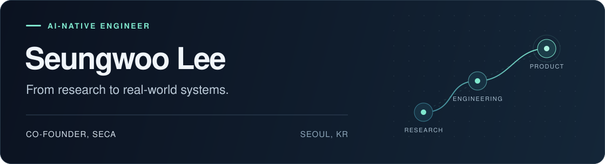

  

  <a href="https://www.linkedin.com/in/seungwoo-dale-lee/">LinkedIn</a> &nbsp;&nbsp;
  <a href="mailto:lifrary2050@gmail.com">Email</a>

## Building products with AI

I'm **Seungwoo (Dale) Lee**, an AI engineer and **co-founder at SECA**, based in Seoul.

I design **end-to-end AI pipelines** and turn them into usable products, connecting data processing, models, tools, and evaluation. I use AI throughout development to build, test, and refine those systems.

At SECA, an AI startup spun out of LG Electronics, I apply this approach to complex hardware data.

Previously at **LG Electronics AI LAB** and **NAVER**, with research experience at **Seoul National University**.

## Selected work

### [agent-tree](https://github.com/lifrary/agent-tree)

A TypeScript CLI and MCP plugin for exploring Claude Code sessions as a navigable tree and resuming from any node. Built to preserve the branches and decisions that a linear summary loses.

[View source](https://github.com/lifrary/agent-tree) or [install from npm](https://www.npmjs.com/package/@seungwoolee/agent-tree).

## Areas of interest

- **AI product engineering**: pipeline design, model integration, evaluation, and workflow automation.
- **Quantitative research**: applying AI to data-driven research and systematic experimentation.
- **Developer tools**: building practical tools for AI-assisted development.
